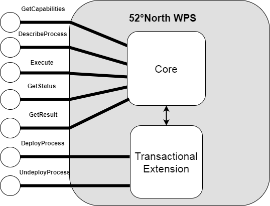

[[FiveTwoN]]
=== 52north

// Please provide content under the headlines given below. Please delete the instructions. At the bottom, you find some instructions on ASCIIDOC.

// Please provide the name of all people you would like to have included in the list of contributing authors on top, following the pattern below:
//Benjamin Pross | 52°North

==== Motivation to Participate

52°North is involved in several projects dealing with processing of large amounts of Earth Observation data. For example, the research project WaCoDis aims to inplement a geoinformation infrastructure for river basin management monitoring tasks including water quality control, water protection and protection of access to clean water. For this purpose remote sensing data from the Copernicus program, waether data and in-situ sensor data will be combined, merged and analyzed. Another example is the RIESGOS research project, which aims to implement multi-risk assessment from natural hazards by utilizing standardized service interfaces.

Furthermore, 52°North has been active in standardizing geoprocessing. Benjamin Pross is currently leading the Web Processing Service 2.0 SWG at OGC. The 52°North WPS implementation fully supports WPS 1.0.0 and 2.0 and is widely used. It has also been used in Testbed-13 Earth Observation Clouds thread.

Since 52°North provides a WPS implementation and is involed in different project dealing Earth Observation data already, the EOEP Hackathon was a good opportunity for us to exercise and increase our knowledge.

==== Implemented Solution
52°North has implemented an Application Deployment and Execution Service based on the 52°North javaPS framework The framework fully supports the WPS 2.0 interface. The means to deploy and undeploy processes were implemented as WPS processs themself. The process descriptions were aligned to the one specified in the OGC Testbed-13: Application Deployment and Execution Service Engineering Report (OGC 17-024). 

[#img_52nADES,reftext='{figure-caption} {counter:figure-num}']
.52°North WPS with ADES-specific extension

.DeployProcess description
[source,xml]
----
<?xml version="1.0" encoding="UTF-8"?><wps:ProcessOfferings xmlns:wps="http://www.opengis.net/wps/2.0" xmlns:ows="http://www.opengis.net/ows/2.0" xmlns:xlink="http://www.w3.org/1999/xlink" xmlns:xsi="http://www.w3.org/2001/XMLSchema-instance" xsi:schemaLocation="http://www.opengis.net/wps/2.0 http://schemas.opengis.net/wps/2.0/wps.xsd">
  <wps:ProcessOffering jobControlOptions="async-execute dismiss sync-execute" outputTransmission="value reference" processVersion="1.0.0" processModel="native">
    <wps:Process xsi:schemaLocation="http://www.opengis.net/wps/2.0 http://schemas.opengis.net/wps/2.0/wps.xsd">
      <ows:Title>Deploy Process</ows:Title>
      <ows:Abstract>This method will deploy an application encapsulated within a Docker container as a process accessible through the WPS interface.</ows:Abstract>
      <ows:Identifier>DeployProcess</ows:Identifier>
      <wps:Input minOccurs="1" maxOccurs="1">
        <ows:Title>Application Package</ows:Title>
        <ows:Abstract>An application package, encoded as an ATOM-encoded OWS context document, describing the details of the application.</ows:Abstract>
        <ows:Identifier>applicationPackage</ows:Identifier>
        <wps:ComplexData>
          <wps:Format mimeType="application/atom+xml" default="true"/>
          <wps:Format mimeType="application/atom+xml"/>
        </wps:ComplexData>
      </wps:Input>
      <wps:Output>
        <ows:Title>Deploy Result</ows:Title>
        <ows:Abstract>The server's response to deploying a process.  A successful response will contain a summary of the deployed process.</ows:Abstract>
        <ows:Identifier>deployResult</ows:Identifier>
        <wps:ComplexData>
          <wps:Format mimeType="text/xml" schema="https://raw.githubusercontent.com/bpross-52n/common-xml/project/eoep/52n-ogc-schema/src/main/resources/META-INF/xml/wps/2.0/wpsDeployResult.xsd" default="true"/>
          <wps:Format mimeType="text/xml" schema="https://raw.githubusercontent.com/bpross-52n/common-xml/project/eoep/52n-ogc-schema/src/main/resources/META-INF/xml/wps/2.0/wpsDeployResult.xsd"/>
        </wps:ComplexData>
      </wps:Output>
    </wps:Process>
  </wps:ProcessOffering>
</wps:ProcessOfferings>
----

.UndeployProcess description
[source,xml]
----
<?xml version="1.0" encoding="UTF-8"?><wps:ProcessOfferings xmlns:wps="http://www.opengis.net/wps/2.0" xmlns:ows="http://www.opengis.net/ows/2.0" xmlns:xlink="http://www.w3.org/1999/xlink" xmlns:xsi="http://www.w3.org/2001/XMLSchema-instance" xsi:schemaLocation="http://www.opengis.net/wps/2.0 http://schemas.opengis.net/wps/2.0/wps.xsd">
  <wps:ProcessOffering jobControlOptions="async-execute dismiss sync-execute" outputTransmission="value reference" processVersion="1.0.0" processModel="native">
    <wps:Process xsi:schemaLocation="http://www.opengis.net/wps/2.0 http://schemas.opengis.net/wps/2.0/wps.xsd">
      <ows:Title>Undeploy Process</ows:Title>
      <ows:Abstract>This method removes a previously deployed process from the WPS.</ows:Abstract>
      <ows:Identifier>UndeployProcess</ows:Identifier>
      <wps:Input minOccurs="1" maxOccurs="1">
        <ows:Title>Process Identifier</ows:Title>
        <ows:Abstract>The identifier of the process to remove from the WPS.</ows:Abstract>
        <ows:Identifier>processIdentifier</ows:Identifier>
        <wps:LiteralData>
          <wps:Format mimeType="application/xml" default="true"/>
          <wps:Format mimeType="text/xml"/>
          <wps:Format mimeType="text/plain"/>
          <wps:Format mimeType="text/plain" encoding="base64"/>
          <LiteralDataDomain default="true">
            <ows:AnyValue/>
            <ows:DataType ows:reference="https://www.w3.org/2001/XMLSchema-datatypes#string">string</ows:DataType>
            <ows:DefaultValue/>
          </LiteralDataDomain>
        </wps:LiteralData>
      </wps:Input>
      <wps:Output>
        <ows:Title>Undeploy Result</ows:Title>
        <ows:Abstract>This is the server's response when undeploying a process. A successful response will contain the identifier of the undeployed process.</ows:Abstract>
        <ows:Identifier>undeployResult</ows:Identifier>
        <wps:ComplexData>
          <wps:Format mimeType="text/xml" schema="https://raw.githubusercontent.com/bpross-52n/common-xml/project/eoep/52n-ogc-schema/src/main/resources/META-INF/xml/wps/2.0/wpsUndeployResult.xsd" default="true"/>
          <wps:Format mimeType="text/xml" schema="https://raw.githubusercontent.com/bpross-52n/common-xml/project/eoep/52n-ogc-schema/src/main/resources/META-INF/xml/wps/2.0/wpsUndeployResult.xsd"/>
        </wps:ComplexData>
      </wps:Output>
    </wps:Process>
  </wps:ProcessOffering>
</wps:ProcessOfferings>
----

Based on the process descriptions, execute requests could be send to the ADES. 

.DeployProcess execute request
[source,xml]
----
<wps200:Execute xmlns:atom="http://www.w3.org/2005/Atom" xmlns:dc="http://purl.org/dc/elements/1.1/" xmlns:georss="http://www.georss.org/georss" xmlns:gml311="http://www.opengis.net/gml" xmlns:owc10="http://www.opengis.net/owc/1.0" xmlns:ows200="http://www.opengis.net/ows/2.0" xmlns:wps200="http://www.opengis.net/wps/2.0" xmlns:xsi="http://www.w3.org/2001/XMLSchema-instance" mode="sync" response="document" service="WPS" version="2.0.0" xsi:schemaLocation="http://www.opengis.net/wps/2.0 http://schemas.opengis.net/wps/2.0/wps.xsd">
<ows200:Identifier>DeployProcess</ows200:Identifier>
  <wps200:Input id="applicationPackage">
    <wps200:Data mimeType="application/atom+xml">
      <atom:feed xml:lang="en">
        <atom:link href="http://www.opengis.net/spec/owc-atom/1.0/req/core" rel="profile" title="This file is compliant with version 1.0 of OGC Context" />
        <atom:link href="http://www.opengis.net/tb13/eoc" rel="profile" title="This file is compliant with Testbed-13 EOC Thread for Application Packing" />
        <atom:id>eoeph18-detectburnedareastestingexceptionreport-1_f4511258-cac0-4955-b952-db6944cf7d4d</atom:id>
        <atom:title>DetectBurnedAreas.testing.ExceptionReport</atom:title>
        <atom:subtitle type="text" />
        <atom:updated />
        <atom:author>
          <atom:email />
        </atom:author>
        <atom:rights>OGC EOEP Hackathon 2018</atom:rights>
        <georss:where>
          <gml311:Polygon>
            <gml311:exterior>
              <gml311:LinearRing>
                <gml311:posList>-90 -180 90 -180 90 180 -90 180 -90 -180</gml311:posList>
              </gml311:LinearRing>
            </gml311:exterior>
          </gml311:Polygon>
        </georss:where>
        <dc:date>2005-01-01T09:08:56.0000000Z/2020-01-23T09:14:08.0000000Z</dc:date>
        <atom:entry>
          <atom:id>eoeph18-detectburnedareastestingexceptionreport-1_f4511258-cac0-4955-b952-db6944cf7d4d</atom:id>
          <atom:link href="http://www.opengis.net/tb13/eoc/application" rel="profile" title="This entry contains an application as specified by Testbed-13 EOC Thread" />
          <atom:title>DetectBurnedAreas.testing.ExceptionReport</atom:title>
          <atom:content type="text">Process deployed through ASB platform</atom:content>
          <owc10:offering code="http://www.opengis.net/tb13/eoc/docker">
            <owc10:content type="text/plain">www.dockerhub.com/eoeph18-wildfires-detector:latest</owc10:content>
          </owc10:offering>
          <owc10:offering code="http://www.opengis.net/tb13/eoc/wpsProcessOffering">
            <owc10:content type="application/xml">
             <wps200:ProcessOfferings>
              <wps200:ProcessOffering>
                <wps200:Process>
                  <ows200:Title>DetectBurnedAreas.testing.ExceptionReport</ows200:Title>
                  <ows200:Abstract>DetectBurnedAreas.testing.ExceptionReport</ows200:Abstract>
                  <ows200:Identifier>eoeph18-detectburnedareastestingexceptionreport-1_f4511258-cac0-4955-b952-db6944cf7d4d</ows200:Identifier>
                  <wps200:Input maxOccurs="1" minOccurs="1">
                    <ows200:Title>Area Of Interest</ows200:Title>
                    <ows200:Abstract />
                    <ows200:Identifier>AreaOfInterest</ows200:Identifier>
                    <wps200:LiteralData>
                      <wps200:Format default="true" encoding="" mimeType="text/plain" schema="" />
                    </wps200:LiteralData>
                  </wps200:Input>
                  <wps200:Input maxOccurs="1" minOccurs="1">
                    <ows200:Title>Time Of Interest</ows200:Title>
                    <ows200:Abstract />
                    <ows200:Identifier>TimeOfInterest</ows200:Identifier>
                    <wps200:LiteralData>
                      <wps200:Format default="true" encoding="UTF-8" mimeType="text/plain" schema="" />
                    </wps200:LiteralData>
                  </wps200:Input>
                  <wps200:Output>
                    <ows200:Title>Result URI</ows200:Title>
                    <ows200:Abstract>URI pointing to a web-accessible folder containing the processed images.</ows200:Abstract>
                    <ows200:Identifier>resultURI</ows200:Identifier>
                    <wps200:LiteralData>
                      <wps200:Format default="true" encoding="UTF-8" mimeType="text/plain" schema="" />
                    </wps200:LiteralData>
                  </wps200:Output>
                </wps200:Process>
              </wps200:ProcessOffering>
             </wps200:ProcessOfferings>
            </owc10:content>
          </owc10:offering>
          <atom:category label="This app runs in Linux" scheme="http://www.opengis.net/tb13/eoc/os" term="LINUX" />
        </atom:entry>
      </atom:feed>
    </wps200:Data>
  </wps200:Input>
</wps200:Execute>
----

.UndeployProcess execute request
[source,xml]
----
<?xml version="1.0" encoding="UTF-8"?>
<wps:Execute xmlns:wps="http://www.opengis.net/wps/2.0"
	xmlns:ows="http://www.opengis.net/ows/2.0" xmlns:xlink="http://www.w3.org/1999/xlink"
	xmlns:xsi="http://www.w3.org/2001/XMLSchema-instance"
	xsi:schemaLocation="http://www.opengis.net/wps/2.0 http://schemas.opengis.net/wps/2.0/wps.xsd"
	service="WPS" version="2.0.0" response="document" mode="sync">
	<ows:Identifier>UndeployProcess</ows:Identifier>
	<wps:Input id="processIdentifier">
		<wps:Data mimeType="text/xml">
		<wps:LiteralValue>http://www.opengis.net/eoephack2018/burnscar</wps:LiteralValue>
		</wps:Data>
	</wps:Input>
	<wps:Output id="undeployResult" transmission="value"
		mimeType="text/xml" schema="https://raw.githubusercontent.com/bpross-52n/common-xml/project/eoep/52n-ogc-schema/src/main/resources/META-INF/xml/wps/2.0/wpsUndeployResult.xsd"/>
</wps:Execute>
----

Based on the Application Package, that is send along as execute-input, a new process wille be created and made available in the capabilities. The process summary will be returned in the execute response.

.DeployProcess execute response
[source,xml]
----
<?xml version="1.0" encoding="UTF-8"?>
<wps:Result xmlns:wps="http://www.opengis.net/wps/2.0" xmlns:ows="http://www.opengis.net/ows/2.0" xmlns:xlink="http://www.w3.org/1999/xlink" xmlns:xsi="http://www.w3.org/2001/XMLSchema-instance" xsi:schemaLocation="http://www.opengis.net/wps/2.0 http://schemas.opengis.net/wps/2.0/wps.xsd">
    <wps:JobID>fb410108-775e-4bdc-8138-f971be428362</wps:JobID>
    <wps:ExpirationDate>2018-05-15T12:33:35Z</wps:ExpirationDate>
    <wps:Output id="deployResult">
        <wps:Data mimeType="text/xml" encoding="UTF-8" schema="https://raw.githubusercontent.com/bpross-52n/common-xml/project/eoep/52n-ogc-schema/src/main/resources/META-INF/xml/wps/2.0/wpsDeployResult.xsd">
            <ns:DeployResult xmlns:ns="http://www.opengis.net/wps/2.0">
                <DeploymentDone>true</DeploymentDone>
                <ProcessSummary xmlns:ows="http://www.opengis.net/ows/2.0" xmlns:wps="http://www.opengis.net/wps/2.0" xmlns:xlink="http://www.w3.org/1999/xlink" xmlns:xsi="http://www.w3.org/2001/XMLSchema-instance" processModel="native" outputTransmission="value reference" processVersion="1.0.0" jobControlOptions="async-execute dismiss sync-execute">
                    <ows:Title>Detect burn scars</ows:Title>
                    <ows:Abstract>This process will detect burned areas within a specified area of interest and during a specified time.</ows:Abstract>
                    <ows:Identifier>http://www.opengis.net/eoephack2018/burnscar</ows:Identifier>
                </ProcessSummary>
            </ns:DeployResult>
        </wps:Data>
    </wps:Output>
</wps:Result>

----

The complete process description looks like the following:

.Description of the newly deployed process
[source,xml]
----

<?xml version="1.0" encoding="UTF-8"?><wps:ProcessOfferings xmlns:wps="http://www.opengis.net/wps/2.0" xmlns:ows="http://www.opengis.net/ows/2.0" xmlns:xlink="http://www.w3.org/1999/xlink" xmlns:xsi="http://www.w3.org/2001/XMLSchema-instance" xsi:schemaLocation="http://www.opengis.net/wps/2.0 http://schemas.opengis.net/wps/2.0/wps.xsd">
  <wps:ProcessOffering jobControlOptions="async-execute dismiss sync-execute" outputTransmission="value reference" processVersion="1.0.0" processModel="native">
    <wps:Process xsi:schemaLocation="http://www.opengis.net/wps/2.0 http://schemas.opengis.net/wps/2.0/wps.xsd">
      <ows:Title>Detect burn scars</ows:Title>
      <ows:Abstract>This process will detect burned areas within a specified area of interest and during a specified time.</ows:Abstract>
      <ows:Identifier>http://www.opengis.net/eoephack2018/burnscar</ows:Identifier>
      <wps:Input minOccurs="1" maxOccurs="1">
        <ows:Title>Time window</ows:Title>
        <ows:Abstract>The time window for the fire scar detection.</ows:Abstract>
        <ows:Identifier>timeWindow</ows:Identifier>
        <wps:LiteralData>
          <wps:Format mimeType="application/xml" default="true"/>
          <wps:Format mimeType="text/xml"/>
          <wps:Format mimeType="text/plain"/>
          <wps:Format mimeType="text/plain" encoding="base64"/>
          <LiteralDataDomain default="true">
            <ows:AnyValue/>
            <ows:DataType ows:reference="https://www.w3.org/2001/XMLSchema-datatypes#string">string</ows:DataType>
            <ows:DefaultValue/>
          </LiteralDataDomain>
        </wps:LiteralData>
      </wps:Input>
      <wps:Input minOccurs="1" maxOccurs="1">
        <ows:Title>aoi</ows:Title>
        <ows:Identifier>aoi</ows:Identifier>
        <wps:BoundingBoxData>
          <wps:Format mimeType="application/xml" default="true"/>
          <wps:Format mimeType="text/xml"/>
          <wps:SupportedCRS default="true">http://www.opengis.net/def/crs/EPSG/0/4326</wps:SupportedCRS>
        </wps:BoundingBoxData>
      </wps:Input>
      <wps:Output>
        <ows:Title>Result URI</ows:Title>
        <ows:Abstract>URI pointing to a web-accessible folder containing the processed images.</ows:Abstract>
        <ows:Identifier>resultURI</ows:Identifier>
        <wps:LiteralData>
          <wps:Format mimeType="application/xml" default="true"/>
          <wps:Format mimeType="text/xml"/>
          <wps:Format mimeType="text/plain"/>
          <wps:Format mimeType="text/plain" encoding="base64"/>
          <LiteralDataDomain default="true">
            <ows:AnyValue/>
            <ows:DataType ows:reference="https://www.w3.org/2001/XMLSchema-datatypes#anyURI">anyURI</ows:DataType>
          </LiteralDataDomain>
        </wps:LiteralData>
      </wps:Output>
    </wps:Process>
  </wps:ProcessOffering>
</wps:ProcessOfferings>

----

The process itself is a mockup, but sending an example execute request is possible:

.Example execute request for the newly deployed process
[source,xml]
----
<?xml version="1.0" encoding="UTF-8"?>
<wps:Execute xmlns:wps="http://www.opengis.net/wps/2.0"
	xmlns:ows="http://www.opengis.net/ows/2.0" xmlns:xlink="http://www.w3.org/1999/xlink"
	xmlns:xsi="http://www.w3.org/2001/XMLSchema-instance"
	xsi:schemaLocation="http://www.opengis.net/wps/2.0 http://schemas.opengis.net/wps/2.0/wps.xsd"
	service="WPS" version="2.0.0" response="document" mode="sync">
	<ows:Identifier>http://www.opengis.net/eoephack2018/burnscar</ows:Identifier>
	<wps:Input id="timeWindow">
		<wps:Data mimeType="text/plain">2017-06-17T/2017-06-28TZ</wps:Data>
	</wps:Input>
	<wps:Input id="aoi">
		<wps:Data mimeType="text/xml">
			<ows:BoundingBox crs="http://www.opengis.net/def/crs/EPSG/0/4326">
				<ows:LowerCorner>59.913464 -136.448354</ows:LowerCorner>
				<ows:UpperCorner>78.794937 -101.931600</ows:UpperCorner>
			</ows:BoundingBox>
		</wps:Data>
	</wps:Input>
	<wps:Output id="resultURI" transmission="value" mimeType="text/plain" />
</wps:Execute>
----

.Example execute response for the newly deployed process
[source,xml]
----
<?xml version="1.0" encoding="UTF-8"?>
<wps:Result xmlns:wps="http://www.opengis.net/wps/2.0" xmlns:ows="http://www.opengis.net/ows/2.0" xmlns:xlink="http://www.w3.org/1999/xlink" xmlns:xsi="http://www.w3.org/2001/XMLSchema-instance" xsi:schemaLocation="http://www.opengis.net/wps/2.0 http://schemas.opengis.net/wps/2.0/wps.xsd">
    <wps:JobID>df0d4be0-b182-4d9c-93e1-158c74bf3215</wps:JobID>
    <wps:ExpirationDate>2018-05-04T12:03:08Z</wps:ExpirationDate>
    <wps:Output id="resultURI">
        <wps:Data mimeType="text/plain" encoding="UTF-8">
            <![CDATA[http://52north.org/delivery/eoep/S1A_IW_SLC__1SDH_20170617.tif]]>
        </wps:Data>
    </wps:Output>
</wps:Result>
----

==== Experiences with AP & ADES
The concept of the ADES works well with WPS and the 52°North WPS could be easily extended with the nacessary functionality. WPS 2.0 processes are a good means for deploying Application Packages and creating new WPS processes. The input- and  output-formats can be described in a standardized way and generic clients are able to execute the Deploy- and UndeployProcess. The 52°North ADES was used for testing by several client developers during the Hackathon. It supports the deployment and execution of new processes based on Application Packages. The backend implementation, i.e. deploying the docker-container specified in the Application Package was not trivial and we had to create a mock-up if this functionality. In Testbed-14 different approaches for enabling WPS with transactional functionality are explored. The Testbed-14 WPS-T ER will specify, how transactional behaviour can be implemented for WPS using additional dedicated operations for deploying and undeploying processes. 

==== Acknowledgement

The contribution of 52°North was supported by the research project
WaCoDis (co-funded by the German Federal Ministry of Transport and
Digital Infrastructure, programme mFund, contract: 19F2038D) and by
the research project RIESGOS (co-fundend by the German Ministry of
Research and Education, programme CLIENT-II, contract: 03G0876).

