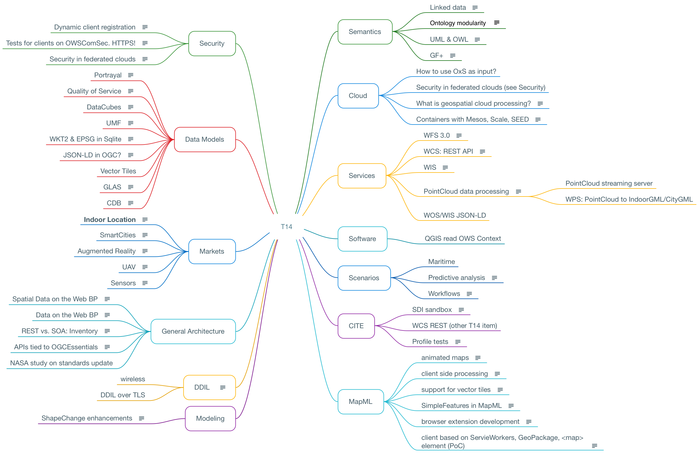

[[Eurac]]
=== Eurac Research

// Please provide content under the headlines given below. Please delete the instructions. At the bottom, you find some instructions on ASCIIDOC.

// Please provide the name of all people you would like to have included in the list of contributing authors on top, following the pattern below:
//Ingo Simonis | OGC
 - Armin Costa | Eurac Research
 - Alexander Jacob | Eurac Research

==== Motivation to Participate
// please describe briefly why you participated

We are striving after development of interoperable research independent of cloud processing facilities to foster exchange and repeatability.
The proposed exercise was perfectly in line with what we currently try to achieve in the in the *H2020 openEO project* ( http://openeo.eu ), where we are already developing a driver to connect the *openEO API* with the *OGC WC(P)S 2.0* and it processing extension. So participating in this hackathon gave as the possibility to implement and test web processing services based on processing chains organized in containers and link it to the RESTful services that we are currently defining and developing in the *openEO* project.

==== Implemented Solution
// please describe your implemented solution here. Provide as much detail as you think reasonable.

The solution implemented by *Eurac Research* consists of an ADES server that exposes a set of operations as describend in the *OGC Testbeds*, in form of a set of *WPS 1.0.0* compliant offerings.
Further an interface with the *openEO API* has been started to be implemented to access those web process services in a RESTful way and render it interoperable with the client API's in *python* and *R* that are currently in development.

The reasons to use WPS 1.0.0 for the implementation are:

- To ensure compatibility with the tools currently employed (i.e GeoServer)
- To ensure compatibility with a larger set of available libraries and tools available
- Have a general, lightweight model that can be easily trasfered also to WPS 2.0.0 in near future

The operations actually implemented as a proof of concept and working prototype are the following:

- **DeployProcess**
- **ExecuteProcess**
- **UndeployProcess**
- **GetStatus**
- Get Result (not yet fully implemented)

Those processes are also discoverable via openEO using the /processes endpoint of the RESTful API. 

The GetCapabilites result for the service implemented:
[source,xml]
----
	<wps:ProcessOfferings>
		<wps:Process wps:processVersion="1.0.0">
			<ows:Identifier>gs:DeployProcessEO</ows:Identifier>
			<ows:Title>DeployProcess</ows:Title>
			<ows:Abstract>DeployProcess Operation EURAC Research EO</ows:Abstract>
		</wps:Process>
		<wps:Process wps:processVersion="1.0.0">
			<ows:Identifier>gs:ExecuteProcessEO</ows:Identifier>
			<ows:Title>ExecuteProcess</ows:Title>
			<ows:Abstract>ExecuteProcess Operation EURAC Research EO</ows:Abstract>
		</wps:Process>
		<wps:Process wps:processVersion="1.0.0">
			<ows:Identifier>gs:GetResultEO</ows:Identifier>
			<ows:Title>GetResult</ows:Title>
			<ows:Abstract>GetResult Operation of Process EURAC Research EO</ows:Abstract>
		</wps:Process>
		<wps:Process wps:processVersion="1.0.0">
			<ows:Identifier>gs:GetStatusEO</ows:Identifier>
			<ows:Title>StatusInfo</ows:Title>
			<ows:Abstract>StatusInfo Operation of Process EURAC Research EO</ows:Abstract>
		</wps:Process>
		<wps:Process wps:processVersion="1.0.0">
			<ows:Identifier>gs:UndeployProcessEO</ows:Identifier>
			<ows:Title>UndeployProcess</ows:Title>
			<ows:Abstract>UndeployProcess Operation EURAC Research EO</ows:Abstract>
		</wps:Process>
	</wps:ProcessOfferings>
----

The implementation uses the proposed OWS Condext Document (OWC) to describe and deploy an application. This seems a very good standard to convey this information and approach to validate the capabilities on a given cluster.

The OWC document is passed as parameter to the WPS DeployProcess operation

The ADES, appart exposing the services, will also perform the following tasks:

- Store all application related information found in the OWS context Document in a persistent DB
- Evaluate and execute the offerings defined in the OWC document, in particular owc offerings related to pulling a given container for the repository, executing a given OpenSearc Query on a catalogue (optional), and executing the defined wpsProcessOffering
- Upon the ExecuteOperation, the ADES will also perform the "staging" operations on the data referenced (i.e. Download the data in a local workskpace $ApplicationRunStore ). The staging is done based on the policies defined in the ProcessParameters (sections -> cloud:.., data:...) and considers, if any, the results of the search offering defined in the OWC document, or the 'data:' defined in the ProcessParameters  --> this allows actually the application developer to have a defined dataset, and also allows the user exventually to execute a paricular or different dataset, of course only if this is validated also by the OWC document (i.e. </georss:where>, <dc:date>)

### DeployProcess

The DeployProcess operation allows to deploy a process defined as an Application OWS Context document (OWC) and has the following Parameters:

- **OWC** : ATOM-encoded OWS Context Document describing the application package
- **Options**: Control Options (...)

DescribeProcess result:
[source,xml]
----
<?xml version="1.0" encoding="UTF-8"?>
<wps:ProcessDescriptions xmlns:xs="http://www.w3.org/2001/XMLSchema"
	xmlns:ows="http://www.opengis.net/ows/1.1" xmlns:wps="http://www.opengis.net/wps/1.0.0"
	xmlns:xlink="http://www.w3.org/1999/xlink" xmlns:xsi="http://www.w3.org/2001/XMLSchema-instance"
	xml:lang="en" service="WPS" version="1.0.0"
	xsi:schemaLocation="http://www.opengis.net/wps/1.0.0 http://schemas.opengis.net/wps/1.0.0/wpsAll.xsd">
	<ProcessDescription wps:processVersion="1.0.0"
		statusSupported="true" storeSupported="true">
		<ows:Identifier>gs:DeployProcessEO</ows:Identifier>
		<ows:Title>DeployProcess</ows:Title>
		<ows:Abstract>DeployProcess Operation EURAC Research EO</ows:Abstract>
		<DataInputs>
			<Input maxOccurs="1" minOccurs="1">
				<ows:Identifier>OWC</ows:Identifier>
				<ows:Title>OWC</ows:Title>
				<ows:Abstract>An ATOM-encoded OWS Context Document describing the application package</ows:Abstract>
				<ComplexData maximumMegabytes="4">
					<Default>
						<Format>
							<MimeType>application/atom+xml</MimeType>
						</Format>
					</Default>
					<Supported>
						<Format>
							<MimeType>application/atom+xml</MimeType>
						</Format>
						<Format>
							<MimeType>application/xml</MimeType>
						</Format>
						<Format>
							<MimeType>text/xml</MimeType>
						</Format>
					</Supported>
				</ComplexData>
			</Input>
			<Input maxOccurs="1" minOccurs="1">
				<ows:Identifier>Options</ows:Identifier>
				<ows:Title>Options</ows:Title>
				<ows:Abstract>Control Options</ows:Abstract>
				<LiteralData>
					<ows:AnyValue />
				</LiteralData>
			</Input>
		</DataInputs>
		<ProcessOutputs>
			<Output>
				<ows:Identifier>DeployResponse</ows:Identifier>
				<ows:Title>DeployResponse</ows:Title>
				<ComplexOutput>
					<Default>
						<Format>
							<MimeType>text/xml</MimeType>
						</Format>
					</Default>
					<Supported>
						<Format>
							<MimeType>text/xml</MimeType>
						</Format>
					</Supported>
				</ComplexOutput>
			</Output>
		</ProcessOutputs>
	</ProcessDescription>
</wps:ProcessDescriptions>
----

If the deployment is sucessful, the response includes a valid ProcessIdentifier UUID usable for the ExecuteProcess and UndeployProcess operations

### ExecuteProcess

Once an application has been deployed and a valid UUID ProcessIdentifier is available, the ExecuteProcess operation allows to execute the applicaction by means of additional, process specific parameters defined in a JSON format.

The parameters for the operation are the following:

- **ProcessInstanceIdentifier:** Identifier of the process instance to be executed (UUID)
- **ProcessParameters:** Parameters for the Process in JSON format
- **Options:** Control Options (mode=sync|async, etc..)

The ProcessParameters are organized in the following sections:

- **cloud:** Cloud specific parameters (ex. Amount of requested resources, Maximum amount to be spent, Timeout policy for killing a process, Scheduler used, etc.)
- **container:** Parameters which are specific to the environment and job scheduler used (eg. docker, kubernetes, Apache Hadoop, etc..)
- **application:** Parameters specific to the application deployed inside a container, which in the simplest general case is the path to the Application entry point (script)
- **data:** Data reference passed to the application. If null, the data referece is adopted by the results of the search offering in the OWC document (code=http://www.opengis.net/spec/owc-atom/1.0/opensearch).

Here is a sample for the ProcessParameters: 
**ProcessParameters:**
[source,json]
----
{
	"cloud":"ncpu=4, environment=docker, exec_policy=parallel",
	"container":"-t --rm -v $ApplicationRunStore:/home/adesuser/data/ -e INPUT_IMAGE=$Data",
	"application":"/home/adesuser/processing_scripts/run.sh",
	"data":"S2B_MSIL1C_20180417T102019_N0206_R065_T32TPP_20180417T140522.zip"
}
----
Both variables $ApplicationRunStore and $Data are possible placeholders and are replaced at runtime by the ADES application.

The variable **$ApplicationRunStore** is a path placeholder and consists in this case of the dedicated working directory assigned automatically by the ADES to a given process instance.

The variable **$Data** is a placeholder for the data referenced by the user, or by a search offering operation defined in the OWC document (code=http://www.opengis.net/spec/owc-atom/1.0/opensearch)

If the request is validated and executed sucessfully the response includes an indentifier of the job executed (JobID)

In the case where a process is executed in parallel on a larger set of files, the response includes a list of JobIDs. This is convenient so that a GetStatus($JobID) operation can be executed on each single child process.

==== Proposed Alternatives
// if you have any recommendations on other solutions, please describe them here

==== Experiences with AP & ADES
// please describe your experiences with the Application Package and the Application Deployment and Execution Service here.

==== Other Impressions & Recommendations
// whatever other impressions, recommendations etc. you have, please put them here

//FROM HERE ON, INSTRUCTIONS ONLY FOLLOW. PLEASE DELETE THIS PART
==== INSTRUCTIONS

[NOTE]
.Instructions
===============================================
This section explains some concepts frequently required by Asciidoc novices. Please use this file as a template for your own clauses.
===============================================

===== Figures
If you want to reference a figure by using a figure number, it is important to use the following syntax. The figure identifier for <<img_mindMap>> is the first statement of the header. Please adapt the width as appropriate.

[#img_mindMap,reftext='{figure-caption} {counter:figure-num}']
.High-Level Mind Map of Testbed-14

It is important that you use the same syntax for all images, otherwise the automatic numbering is corrupted!

===== Tables
Tables are easy to deal with as long as you keep them simple! To add a table, please use the following syntax.

[#table_countries,reftext='{table-caption} {counter:table-num}']
.Countries in Europe
[cols="50e,^25m,>25s",width="75%",options="header",align="center"]
|===
|Country | Population | Size

| Monaco
| 36371
| 1.98

| Gibraltar
| 29431
| 6.8
|===

The first line is used for referencing. You can reference <<table_countries>> in your text. The only thing you should change in that line is the table id, which is "table_countries" in this case. Please do not remove the "#", please do not change anything else in that line.

You can define the style and width of each column. In our example, the first column takes 50% of the entire width, the second and third column take 25% each. The total width of the table is 75% of the text width.

The letters after the width percentage indicate if the column is e=emphasis, m=monospaced, a=asciidoc, s=strong. The d=default does not need to be set.

Cell alignment: If you need to align a column, you may indicate this by setting ^,<, or >. Examples:

* ^25m = centered, 25% width, monospaced.
* >25e = aligned right, 25% width, emphasised
* <25 = aligned left, 25% width, asciidoc

In any case, please make sure that your table fit on a piece of A4 or letter-size paper!!

===== Recommended Asciidoc Environment
We recommend to use http://asciidoctor.org[asciidoctor] and http://asciidoctor.org/docs/convert-asciidoc-to-pdf/[asciidoctor-pdf] in combination with the https://atom.io[Atom] editor.

In Atom, you should install the following packages:

* asciidoc-preview
* autocomplete-asciidoc
* language-asciidoc
* markdown-writer: requires changing of key-map to allow for keyboard shortcuts such as e.g. *bold*
* platformio-IDE-terminal

This environment allows you to use keyboard shortcuts, autocomplete, syntax highlighting and a rendered preview for asciidoc; and provides you an terminal window within the editor to convert your asciidoc to html and pdf.

===== Asciidoc Conversion
In order to achieve a uniform look-and-feel of all ERs in both HTML and PDF, we have provided a css and theme file. The following commands can be used to convert the ER:

*Command for PDF output:*
 asciidoctor-pdf -a pdf-stylesdir=resources -a pdf-style=ogc -a pdf-fontsdir=resources/fonts -o 18-xxx.pdf  er.adoc

*Command for HTML output:*
 asciidoctor -a data-uri -a stylesheet=ogc.css -a stylesdir=./resources/stylesheets -o 18-xxx er.adoc

===== Source Code

You can add code snippets using the following syntax:

.Code Example XML
[source,xml]
----
<section>
  <title>Section Title</title> <!--1-->
</section>
----
<1> This notation allows to reference particular sections within the code.

.Code Example JSON
[source,json]
----
{"menu": {
  "id": "file",
  "value": "File",
  "popup": {
    "menuitem": [
      {"value": "New", "onclick": "CreateNewDoc()"},
      {"value": "Open", "onclick": "OpenDoc()"},
      {"value": "Close", "onclick": "CloseDoc()"}
    ]
  }
}}
----

===== Asciidoc(tor) Syntax Help
Is available e.g. here: http://asciidoctor.org/docs/

===== Citations
Please use the following syntax to insert citations:

cite:[VanZyl2009]

Then you need to provide all citation information in the file resources/bibtex-file.bib. Everything else is done automatically.

For further information, please consult https://github.com/asciidoctor/asciidoctor-bibtex.
