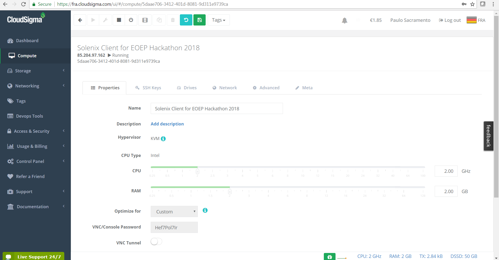
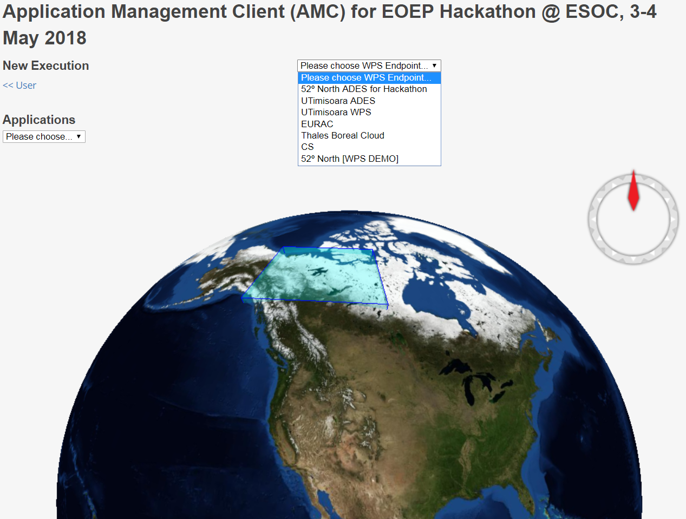
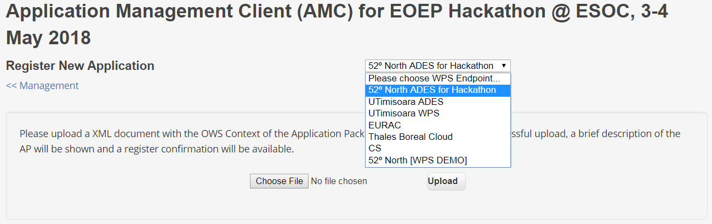
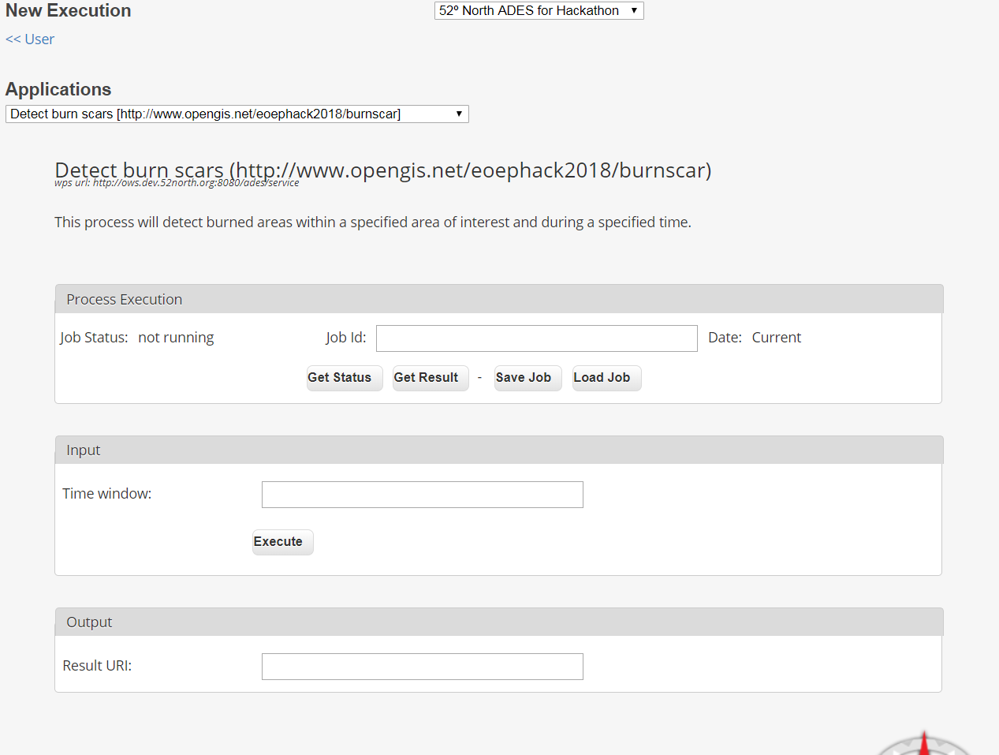

[[Solenix]]
=== Solenix

//Paulo Sacramento | Solenix
//Daniel Robinson | Solenix

==== Motivation to Participate
Solenix participated in the EOEP Hackathon with two main objectives.

The first objective was to demonstrate the validity and interoperability of its contribution to OGC Testbed-13 - in particular the Application Management Client (AMC) deliverable - and in general of the OGC Testbed-13 results.
Two results in particular were relevant both for the Testbed activities and for the Hackathon: the Application Package encoding as a OWS Context document; and the use of WPS for the interface between the AMC and the Application Deployment and Execution Service (ADES).

The second objective was to bridge between Testbed-13 and Testbed-14, even if Solenix committed to participating in the Hackathon without knowing if it would be involved in Testbed-14. Indeed, several topics addressed in the Hackathon were also addressed in Testbed-13 and will be relevant and revisited in Testbed-14.
Given that, during the Hackathon, Solenix's participation in Testbed-14 was confirmed, the Hackathon provided a smooth flow between the two initiatives and a jump-start in Testbed-14.

==== Starting Assets
Solenix brought the two following assets to the Hackathon:

* The Application Management Client (AMC) developed for OGC Testbed-13
* Examples of Application Packages in OWS Context format, also taken from Testbed-13

Solenix's AMC supports the Application Package (AP) in OWS Context format and implements generic WPS client functionality, which allows a user to browse, register and trigger execution of processes on several instances of the ADES.
It also implements the basic OpenSearch catalogue flow integrated in the WebWorldWind 3D globe using FEDEO as endpoint. This implementation is very simplified, both in terms of the UI and in terms of functionality, since only the second step of the two-step search is implemented (i.e. the actual search for products. The collection discovery is bypassed and only well-known collection endpoints are used). It should be noted, in any case, that this functionality was not envisaged to be necessary for the Hackathon and in fact it was not required.

The examples of Application Package in OWS Context format are available at https://github.com/opengeospatial/EOEPHackathon2018/tree/master/AP .

==== Implemented Solution
The AMC software was deployed on a Virtual Machine hosted on CloudSigma's Frankfurt data center, taking advantage of that Cloud Provider's sponsoring of the Hackathon.
[#img_slx_cloudsigma,reftext='Figure {counter:figure-num}']

The AMC was then minimally tailored for the Hackathon, with no significant functional changes. The set of endpoints made available by participants providing ADES implementations was configured and a rectangle corresponding to the Canadian Northwestern Territories was determined (based on a Shape file provided by ESA/NRCAN) and drawn over the WebWorldWind 3D globe.
[#img_slx_client_exec,reftext='Figure {counter:figure-num}']

No other changes were made or required to be able to interoperate with available and working ADES providers, which is a demonstration of the validity of the Testbed-13 EOC results and the Solenix AMC implementation.
In fact, in all attempted cases, once network connectivity (firewalls, blocked ports) and CORS (Cross-Site Scripting protection) issues were solved, the AMC managed to interact with the ADES implementations using the WPS functionality coming out of Testbed-13. This further attested to the maturity and interoperability power of WPS.

==== Experiences with AP & ADES
One of the AP examples mentioned above was modified as required for the Hackathon, several times during the final event, in agreement with other Participants.
The AP used for the final demo is available at https://github.com/opengeospatial/EOEPHackathon2018/blob/master/AP/hackathon-ap.xml .
It is reproduced here for completeness.

.Application Package XML
[source,xml]
----
<feed xmlns="http://www.w3.org/2005/Atom" xmlns:dc="http://purl.org/dc/elements/1.1/" xmlns:georss="http://www.georss.org/georss" xmlns:gml="http://www.opengis.net/gml" xmlns:ows="http://www.opengis.net/ows/2.0" xmlns:owc="http://www.opengis.net/owc/1.0" xmlns:os="http://a9.com/-/spec/opensearch/1.1/" xml:lang="en">
    <link rel="profile" href="http://www.opengis.net/spec/owc-atom/1.0/req/core" title="This file is compliant with version 1.0 of OWS Context"/>
    <link rel="profile" href="http://www.opengis.net/tb13/eoc" title="This file is compliant with Testbed-13 EOC Thread for Application Packaging"/>
    <id>http://www.opengis.net/eoephack2018/burnscar</id>
    <title>Application Package for Burn Scar Detection application</title>
    <subtitle type="text">Burn Scar Detection</subtitle>
    <updated>2018-05-03T18:25:00Z</updated>
    <author>
        <name>Paulo Sacramento</name>
    </author>
    <rights>-</rights>
    <entry>
        <title>Burn Scar Detection Application for OGC EOEP Hackathon 2018</title>
        <id>http://www.opengis.net/eoephack2018/burnscar</id>
        <updated>2018-05-03T18:25:00Z</updated>
        <content type="html">Burn Scar Detection Application for OGC EOEP Hackathon 2018 &lt;br/&gt; This application detects burn scars over a Summer period on Canada's Northwestern Territories, using Sentinel data.</content>
        <!-- DockerImage offering -->
        <owc:offering code="http://www.opengis.net/tb13/eoc/docker">
            <owc:content type="text/plain">registry.hub.docker.com/cnlspacebel/landcover</owc:content>
            <inputs>
            	<name>image</name>
            </inputs>
        </owc:offering>
        <owc:offering code="http://www.opengis.net/tb13/eoc/wpsProcessOffering">
            <owc:content type="application/xml">
                <wps:ProcessOffering jobControlOptions="async-execute dismiss" outputTransmission="value reference" xmlns:ows="http://www.opengis.net/ows/2.0" xmlns:wps="http://www.opengis.net/wps/2.0" xmlns:xlink="http://www.w3.org/1999/xlink">
                    <wps:Process>
                        <ows:Title>Burn Scar Detection Demo</ows:Title>
                        <ows:Abstract>This application detects burn scars over a Summer period on Canada's Northwestern Territories, using Sentinel data.</ows:Abstract>
                        <ows:Identifier>BurnScarDemo</ows:Identifier>
                        <wps:Input>
                            <ows:Title>Area Of Interest</ows:Title>
                            <ows:Abstract>Area of interest (AOI) as a WKT POLYGON text string.</ows:Abstract>
                            <ows:Identifier>AreaOfInterest</ows:Identifier>
                            <wps:LiteralData>
                                <!-- Not sure if WKT has a MIME type -->
                                <wps:Format mimeType="text/plain" default="true"/>
                                <LiteralDataDomain default="true">
                                    <ows:AnyValue/>
                                    <ows:DataType ows:reference="http://www.w3.org/2001/XMLSchema#string">String</ows:DataType>
                                    <ows:DefaultValue>POLYGON((70 -140, 58 -140, 58 -100, 70 -100, 70 -140))</ows:DefaultValue>
                                </LiteralDataDomain>
                            </wps:LiteralData>
                        </wps:Input>
                        <wps:Input>
                            <ows:Title>Start Time Of Interest</ows:Title>
                            <ows:Abstract>Start Time of Interest for the processing, as an RFC 3339 date-time text string. Example: 1990-12-31T23:59:60Z</ows:Abstract>
                            <ows:Identifier>StartTimeOfInterest</ows:Identifier>
                            <wps:LiteralData>
                                <wps:Format mimeType="text/plain" default="true"/>
                                <LiteralDataDomain default="true">
                                    <ows:AnyValue/>
                                    <ows:DataType ows:reference="http://www.w3.org/2001/XMLSchema#string">String</ows:DataType>
                                    <ows:DefaultValue>2017-06-17T00:00:00Z</ows:DefaultValue>
                                </LiteralDataDomain>
                            </wps:LiteralData>
                        </wps:Input>
                        <wps:Input>
                            <ows:Title>Stop Time Of Interest</ows:Title>
                            <ows:Abstract>Stop Time of Interest for the processing, as an RFC 3339 date-time text string. Example: 1990-12-31T23:59:60Z</ows:Abstract>
                            <ows:Identifier>StopTimeOfInterest</ows:Identifier>
                            <wps:LiteralData>
                                <wps:Format mimeType="text/plain" default="true"/>
                                <LiteralDataDomain default="true">
                                    <ows:AnyValue/>
                                    <ows:DataType ows:reference="http://www.w3.org/2001/XMLSchema#string">String</ows:DataType>
                                    <ows:DefaultValue>2017-06-28T23:59:59Z</ows:DefaultValue>
                                </LiteralDataDomain>
                            </wps:LiteralData>
                        </wps:Input>
				        <wps:Output>
                            <ows:Title>Result URL (TIF file)</ows:Title>
                            <ows:Abstract>URL pointing to result (GeoTIF file)</ows:Abstract>
                            <ows:Identifier>ResultURL</ows:Identifier>
                            <wps:ComplexData>
                                <wps:Format mimeType="text/url" default="true"/>
                            </wps:ComplexData>
                        </wps:Output>
                    </wps:Process>
                </wps:ProcessOffering>
            </owc:content>
        </owc:offering>
    </entry>
    <entry>
        <title>OpenSearch Collections</title>
        <id>http://www.opengis.net/tb13/eoc/OS_Collections</id>
        <updated>2017-09-04T15:23:09Z</updated>
        <content type="html">EOC OpenSearch Collections</content>
        <owc:offering code="http://www.opengis.net/spec/owc-atom/1.0/opensearch">
            <owc:content type="application/opensearchdescription+xml" href="https://finder.eocloud.eu/resto/api/collections/Sentinel1/describe.xml"/>
        	<mapping>
			    <query>
                       <map key="AreaOfInterest" value="geometry" />
                       <map key="StartTimeOfInterest" value="startDate"/>
                       <map key="StopTimeOfInterest" value="stopDate"/>
			    </query>
			    <inputs>
			        <map key="image" value="features[*].properties.productIdentifier" />
			    </inputs>
			</mapping>
        </owc:offering>
    </entry>
</feed>
----

Besides the basic administrative information about the application (Burn Scar Detection), the following features are worth highlighting:

* On the first entry, one offering pointing to the Docker container with the application code to be run by ADES
* Still on the first entry, one offering containing a WPS Process Description of the Burn Scar Detection process, consisting of three inputs - Area of Interest as a WKT string (the default polygon is the one mentioned previously, for the Northwestern Territories of Canada), Start and Stop times of interest - and one output, for the URL where it will be possible to obtain the results of the processing.
* On a second entry, a further offering consisting of the OpenSearch collection endpoint to be used as a catalogue and a mapping of field names which is necessary to address the fact that the OpenSearch standard does not specify/constrain this, which leads to different implementations using different names

During the two days of the final demo event, it was possible to attempt integration with a few ADES implementations, with varying degrees of success.
Using the AP above or slight variations, it is possible to register the AP after choosing one of the available ADES, using the following page:
[#img_slx_client_register_AP,reftext='Figure {counter:figure-num}']

On uploading the AP, the AMC prints-out some general information about the AP and asks for a confirmation. Once this is given, under the hood the AMC contacts the ADES using the WPS Execute operation on a specially prepared process called 'DeployProcess'.

After the application is registered, it can be selected for usage. Application execution can be triggered after filling-in the fields of the dynamically generated form built from the WPS Process Description returned by the ADES as a DescribeProcess response.
The Figure below shows this for an earlier version of the Burn Scar Detection Application Package which considered a single time window of interest field instead of two separate fields, one for the start time and one for the stop time:
[#img_slx_client_exec_52North_BurnScar,reftext='Figure {counter:figure-num}']

Besides the 52 North ADES, with which partial integration was successfully implemented before the final event (it was not possible to integrate the complete execution flow), it was possible to fully integrate and demonstrate the complete flow using the University of Timisoara's ADES implementation during the final event.

For what concerns the Thales implementation, by the end of the final event there were still CORS and connectivity issues due to the fact that they were using the Boreal Cloud made available by NRCan, which is not easily accessible through the Internet.
All parties agreed and were confident, however, that had these issues been addressed, integration would have been possible, since both the Solenix AMC and the Thales ADES implement standard WPS.

As can be seen in the Figure above, the University of Timisoara actually exposed two endpoints, one called ADES for the registration/unregistration of Application Packages and another one called WPS for the actual execution of processes.
Even if this was not the original intention and none of the Testbed-13 ADES implementations or other Hackathon implementations did this, it does not pose any negative consequences and in fact it was agreed to keep it such to highlight that it is also a valid approach.
It can actually be argued that this is a desirable split between two kinds of function which are fundamentally different and have different access requirements (the application registration/unregistration, for privileged users; and the application execution, for regular users).
It was mentioned during the final event that from the Testbed-13 ERs it was not evident that the two functions were supposed to be provided by a single endpoint, which is a point of improvement for future Tested ERs.

Finally, it should be mentioned that integration with EURAC's backend was also attempted, but this was not possible for two main reasons: the fact that EURAC's backend did not send appropriate headers and so the browser's CORS protections did not allow the requests to complete (requires adequate server configuration to work); and the fact that also EURAC, similarly to NRCan with the Boreal Cloud, has its own private infrastructure which is not easily accessible through the Internet.
To allow access, EURAC put in place a proxy and implemented simple HTTP Authentication, but all attempts to change the client to send appropriate authentication headers did not succeed. The EURAC backend responded with a valid GetCapabilities response, but the Process offering was always empty (which EURAC confirmed was the expected result when authentication fails).
