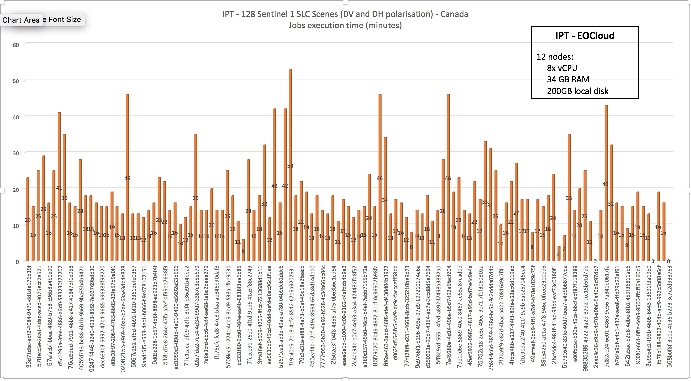

[[UTimisoara]]
=== West University of Timisoara & Institute eAustria Timisoara

Marian Neagul | UVT

Teodora Selea | UVT

Silviu Panica | IeAT


==== Motivation to Participate

Our participation to the EOEP Hackathon was motivated by our aim of further
extending the WPS 2.0 server developed as part of the ESA funded EO4SEE Project.

Particularly we are interested in insuring interoperability with third-party WPS
implementations and adherence to the recommendations originating from the Testbed
activities.

==== Implemented Solution
Our solution involved introducing  a series of new conventions inside the
Application Package, conventions agreed upon on-site during the Hackathon.
Particularly the conventions have been endorsed by Solenix, 52North and VITO.
The details of the modified Application Package are described in <<ap-and-ades>>

The implemented solution demonstrated complete interaction between the AMC
developed by Solenix and the EWPS Server provided by UVT and supported by IeAT.
The solution demonstrated that interaction between the various components
envisioned in Testbed13 is feasible.

The demonstration presented at the Hackathon involved the execution of
the complete application lifecycle:

 - Application Deployment
 - Application Execution
 - Application UnDeployment

It is worth mentioning that the triggered application execution successfully
completed the proposed use-case scenario.
Runtime information regarding the execution can be seen in <<img_ewps_execution>>

[#img_ewps_execution,reftext='{figure-caption} {counter:figure-num}']
.Application Execution Statistics


===== Implementation

The solution proposed by UVT and IeAT involved the deployment of EWPS and the
required backend components on the IPT Poland cloud.

From a high level perspective the our solution was composed out of:

 - EWPS WPS 2.0 Server running as managed Marathon container
 - https://github.com/twosigma/Cook[Cook Scheduler] managed by Marathon
 providing job scheduling capabilities
 - The https://mesosphere.github.io/marathon/[Marathon] container orchestration
 framework
 - http://mesos.apache.org/[Mesos] Mesos Cluster running on top of 12 nodes
 providing compute resources

==== Proposed Alternatives

==== Experiences with AP & ADES
[[ap-and-ades]]
// please describe your experiences with the Application Package and the Application Deployment and Execution Service here.

As part of the Hackathon we agreed together with the other participants
(particularly Solenix, 52North, and VITO) an modified version of the
https://github.com/opengeospatial/EOEPHackathon2018/blob/master/AP/hackathon-ap.xml[application package]

The application package assumed the introduction of an `mapping` section inside the
`owc:offering` node, as depicted bellow.

```
<entry>
  <title>OpenSearch Collections</title>
  <id>http://www.opengis.net/tb13/eoc/OS_Collections</id>
  <updated>2017-09-04T15:23:09Z</updated>
  <content type="html">EOC OpenSearch Collections</content>
  <!-- OpenSearch offering for Spacebel -->
  <owc:offering code="http://www.opengis.net/spec/owc-atom/1.0/opensearch">
    <owc:content type="application/opensearchdescription+xml" href="https://finder.eocloud.eu/resto/api/collections/Sentinel1/describe.xml"/>
    <mapping>
      <query>
        <map key="AreaOfInterest" value="geometry"/>
        <map key="StartTimeOfInterest" value="startDate"/>
        <map key="StopTimeOfInterest" value="completionDate"/>
      </query>
      <inputs>
        <map key="image" value="features[*].properties.productIdentifier"/>
      </inputs>
    </mapping>
  </owc:offering>
</entry>
```

The `mapping` node was aiming two different purposes:

 - Mapping attributed to OpenSearch queries (the `query` node);
 - Mapping WPS processing inputs to jobs handled by the underlying execution
 system, and merged together from the OpenSearch query using an
 http://goessner.net/articles/JsonPath/[jsonpath expression];

==== Other Impressions & Recommendations

The Hackathon was of great value for UVT/IeAT as we have not been involved in
the Testbed activities. It allowed us to test interoperation with different
clients (Solenix) and ADES implementation (Solenix).

Our main recommendation would be that the next hackathon activities should have
a dedicated session for demission making and agreeing upon common rules;
