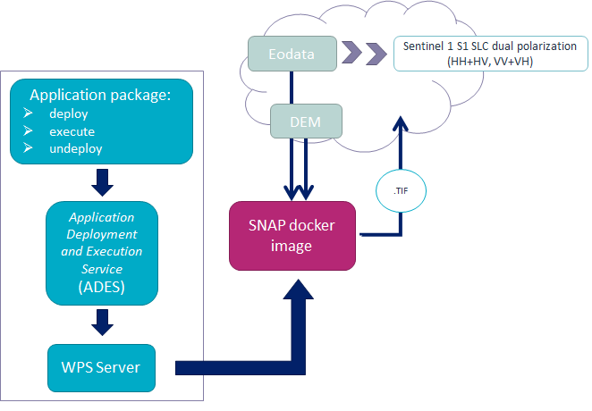
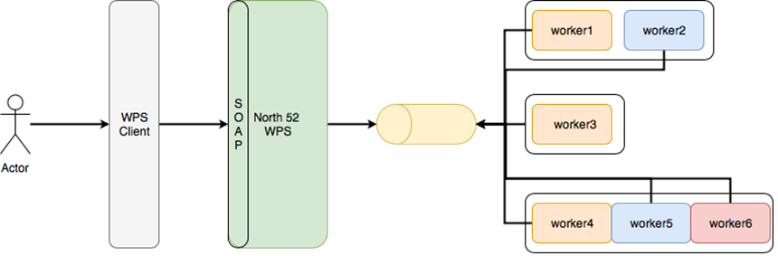
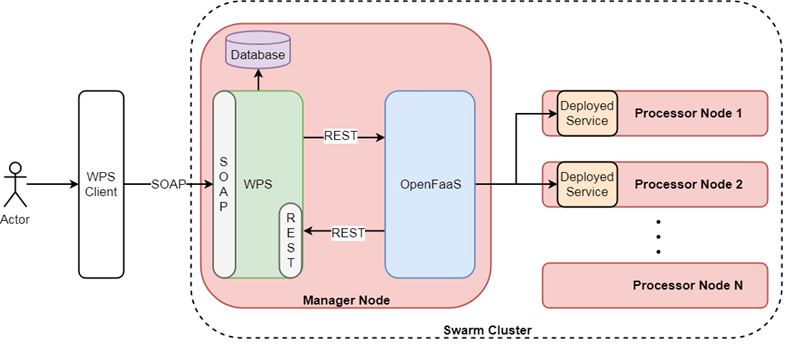
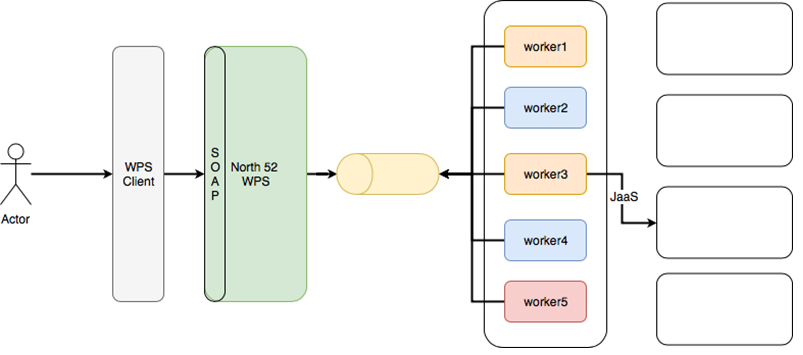
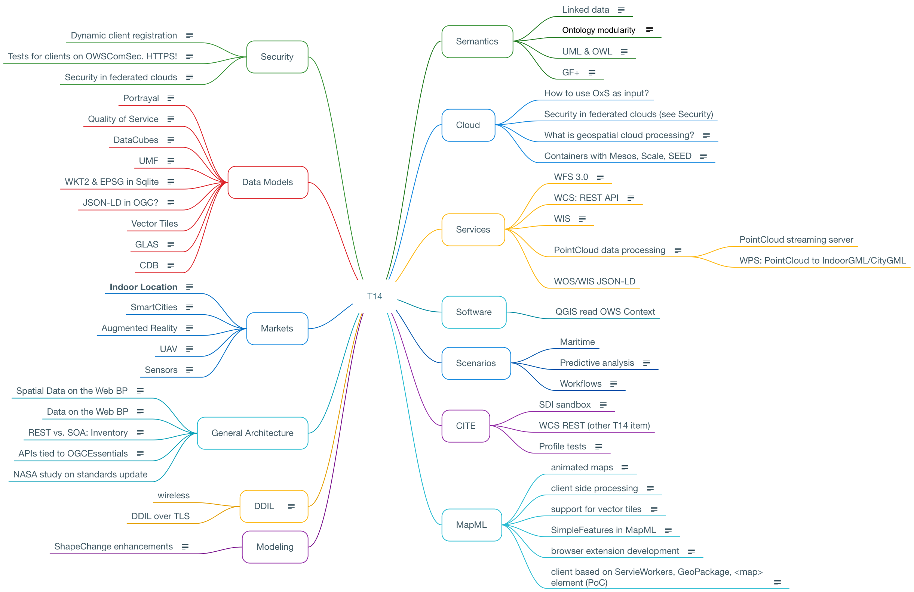

=== Thales Alenia Space

// Please provide the name of all people you would like to have included in the list of contributing authors on top, following the pattern below:

 Contributors: 
 - David Pérez (david.perezizquierdo@thalesaleniaspace.com)
 - Alejandro Mousist (alejandro.mousist@thalesaleniaspace.com)
 - Elisa Callejo (e.c@thalesaleniaspace.com)

==== Motivation to Participate
// please describe briefly why you participated
Our participation to the EOEP Hackathon was aimed for starting into the earth observation testing different solutions, working with common tools as SNAP or WPS server development and providing our background knowledge in different tools and services. Particulary we are interested in develop a server back-end fully integrated with a client and make a portable solution, which can be installed in a cloud totally accesible.

==== Implemented Solution
// please describe your implemented solution here. Provide as much detail as you think reasonable.
At this chapter, it will be described the final Thales Alenia Space implemented solution, after testing different solution (can be seen in next chapter).

During the hackathon, several developments and configurations were done. First of all the cloud required had to be configured in order to upload the developments there. At the begining it was chosen Cloudferro, but after uploading our developments there and due a lack of resources in the cloud, during the hackathon meeting we migrate all the developments to Boreal Cloud, where we can have the same size machines.

Cloudferro configuration:

 - 5 hosts: 16vCPU and 128GB RAM
 - 1 host: 8vCPU and 64GB RAM
 - 4 hosts: 8vCPU and 32GB RAM
 
As can be seen the machines were different, therefore we had a lack of performance in those machines, having as maximun of 15 workers (SNAP executions) executed at the same time.

Boreal cloud configuration:

- 7 hosts: 40vCPU and 163GB RAM

Using this last configuration, we got to improve the configuration

The products from sentinel and the DEM where mounted in the machines as mount point, therefore were easy accesible.

The outline of the Thales solution can be seen in <<img_outline>>

[#img_outline,reftext='{figure-caption} {counter:figure-num}']
.Hackathon outline

The final implemented solution can be seen in <<img_implemented>>

[#img_implemented,reftext='{figure-caption} {counter:figure-num}']
.Final TASE implemented solution

==== Proposed Alternatives
// if you have any recommendations on other solutions, please describe them here
During the period of the hackathon we tried several options to make the backend works. First of all our idea was to implement faas (function as a service) integrated with docker swarm, in order to manage the balancing between all the nodes when running SNAP application to process the products. This implemented solution can be seen in <<img_faas>>

[#img_faas,reftext='{figure-caption} {counter:figure-num}']
.Faas implemented solution of TASE

After that trial, the balancing in the faas solution was not working properly, so the solution had to be changed and the alternative approach was using jaas (jobs as a service), which is able to run docker images balancing the load between the whole docker swarm cluster. Using this solution, in an automated environment where the tasks were run automatically, in some of the nodes those executions were not properly run, and therefore this solution was not valid to test the performance.This implemented solution can be seen in <<img_jaas>>

[#img_jaas,reftext='{figure-caption} {counter:figure-num}']
.Jaas implemented solution of TASE

Discarding the previous two solutions, we opt for the solution done in implemented solution, using a Thales Alenia Space designed solution.

==== Experiences with AP & ADES
// please describe your experiences with the Application Package and the Application Deployment and Execution Service here.

==== Other Impressions & Recommendations
// whatever other impressions, recommendations etc. you have, please put them here

Different constrains have been found during the hackathon implementation:
The SNAP application has two major improvements which give more value to the tool. In first place, the application size should be reduced in order to work properly in a docker clusterized environment. The other improvement is the based on the kind of application, which is monolitich, which means that cannot be split in the different workers along the cluster. With this approach, the processing time of the execution will never be reduced, so it will be needed more computers or larger computers in order to run more than one SNAP application at the same time. Using an environment based on spark, and adapting the tool, this time can be reduced in order to do calls in near real time.

Based on the size and the computing requirements of SNAP, the cloud where the process is run should be big enough to be able to run the process. Most of the issues regarding the cloud were in terms of performance and accessing through the different open ports. Also the mount point in the cloud has to be reliable enought to allow the execution of SNAP.

The Hackathon was valuable for Thales Alenia Space as we have not been involved in the Testbed activities. It allowed us to develop and test the communication with clients and ADES.

//FROM HERE ON, INSTRUCTIONS ONLY FOLLOW. PLEASE DELETE THIS PART
==== INSTRUCTIONS

[[ExampleClause]]
== Example Clause

[NOTE]
.Instructions
===============================================
This section explains some concepts frequently required by Asciidoc novices. Please use this file as a template for your own clauses.
===============================================

=== Headlines
All headlines are marked by "=" signs. The top level in each each file starts with level 2 ("=="). Important: For whatever strange reason, headings in annexes are marked differently.

=== Figures
If you want to reference a figure by using a figure number, it is important to use the following syntax. The figure identifier for <<img_mindMap>> is the first statement of the header. Please adapt the width as appropriate.

[#img_mindMap,reftext='{figure-caption} {counter:figure-num}']
.High-Level Mind Map of Testbed-14

It is important that you use the same syntax for all images, otherwise the automatic numbering is corrupted!

=== Tables
Tables are easy to deal with as long as you keep them simple! To add a table, please use the following syntax.

[#table_countries,reftext='{table-caption} {counter:table-num}']
.Countries in Europe
[cols="50e,^25m,>25s",width="75%",options="header",align="center"]
|===
|Country | Population | Size

| Monaco
| 36371
| 1.98

| Gibraltar
| 29431
| 6.8
|===

The first line is used for referencing. You can reference <<table_countries>> in your text. The only thing you should change in that line is the table id, which is "table_countries" in this case. Please do not remove the "#", please do not change anything else in that line.

You can define the style and width of each column. In our example, the first column takes 50% of the entire width, the second and third column take 25% each. The total width of the table is 75% of the text width.

The letters after the width percentage indicate if the column is e=emphasis, m=monospaced, a=asciidoc, s=strong. The d=default does not need to be set.

Cell alignment: If you need to align a column, you may indicate this by setting ^,<, or >. Examples:

* ^25m = centered, 25% width, monospaced.
* >25e = aligned right, 25% width, emphasised
* <25 = aligned left, 25% width, asciidoc

In any case, please make sure that your table fit on a piece of A4 or letter-size paper!!

=== Recommended Asciidoc Environment
We recommend to use http://asciidoctor.org[asciidoctor] and http://asciidoctor.org/docs/convert-asciidoc-to-pdf/[asciidoctor-pdf] in combination with the https://atom.io[Atom] editor.

In Atom, you should install the following packages:

* asciidoc-preview
* autocomplete-asciidoc
* language-asciidoc
* markdown-writer: requires changing of key-map to allow for keyboard shortcuts such as e.g. *bold*
* platformio-IDE-terminal

This environment allows you to use keyboard shortcuts, autocomplete, syntax highlighting and a rendered preview for asciidoc; and provides you an terminal window within the editor to convert your asciidoc to html and pdf.

=== Asciidoc Conversion
In order to achieve a uniform look-and-feel of all ERs in both HTML and PDF, we have provided a css and theme file. The following commands can be used to convert the ER:

*Command for PDF output:*
 asciidoctor-pdf -a pdf-stylesdir=resources -a pdf-style=ogc -a pdf-fontsdir=resources/fonts -o 18-xxx.pdf  er.adoc

*Command for HTML output:*
 asciidoctor -a data-uri -a stylesheet=ogc.css -a stylesdir=./resources/stylesheets -o 18-xxx er.adoc

=== Source Code

You can add code snippets using the following syntax:

.Code Example XML
[source,xml]
----
<section>
  <title>Section Title</title> <!--1-->
</section>
----
<1> This notation allows to reference particular sections within the code.

.Code Example JSON
[source,json]
----
{"menu": {
  "id": "file",
  "value": "File",
  "popup": {
    "menuitem": [
      {"value": "New", "onclick": "CreateNewDoc()"},
      {"value": "Open", "onclick": "OpenDoc()"},
      {"value": "Close", "onclick": "CloseDoc()"}
    ]
  }
}}
----

=== Asciidoc(tor) Syntax Help
Is available e.g. here: http://asciidoctor.org/docs/

=== Citations
Please use the following syntax to insert citations:

cite:[VanZyl2009]

Then you need to provide all citation information in the file resources/bibtex-file.bib. Everything else is done automatically.

For further information, please consult https://github.com/asciidoctor/asciidoctor-bibtex.
